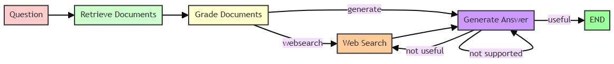
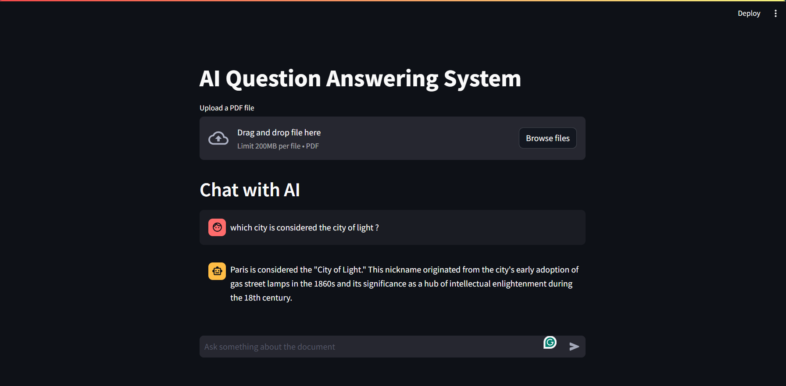

# QA-bot-RAG
This is a mini project to build a QA bot using Retrieval Augmented Generation (RAG) model.
I utilized Llama3-70B model via API and construct a RAG pipeline to generate more accurate answers to user's questions.

The overall architecture of the project is as follows:

1. User uploads a pdf file
2. The pdf file is processed and chunked, then stored in a vector database
3. When user asks a question, the question is vectorized and compared with the vector database to find the most relevant chunk. If the chunk is found, the chunk is passed to the RAG model to generate the answer.
4. If the chunk is not found, a WebSearch Tool is used to find the most relevant information from the web. The information is then passed to the RAG model to generate the answer.
5. The answer is displayed to the user.

## How to run
1. Clone the repository
2. Install the required packages. Change the python interpreter to the venv and upload a sample pdf file to the data folder. Then, copy the file path and replace it with the variable "init_filepath" in main.py. That will be the base file for the model.
```bash
   pip install -r requirements.txt
   ```
3. Run the following command:
```bash
   python -m streamlit run src\app.py
   ```
4. Wait for the app to open in your browser. Uploading your pdf files if neccessary and start asking questions.


## Demo
